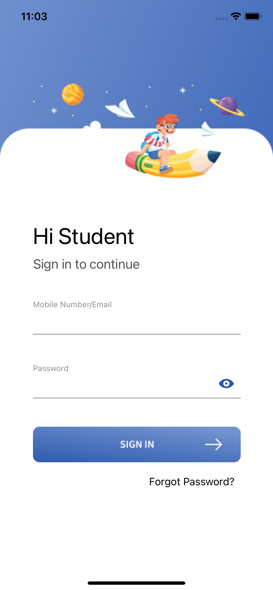
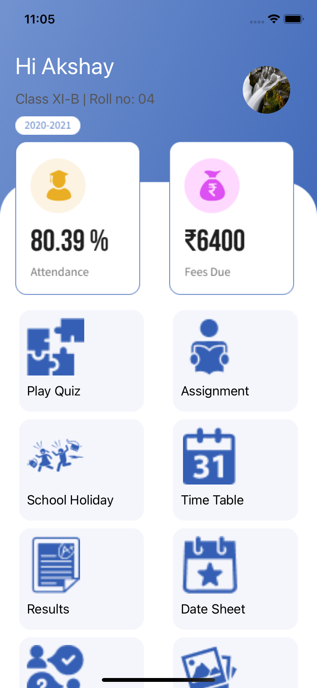
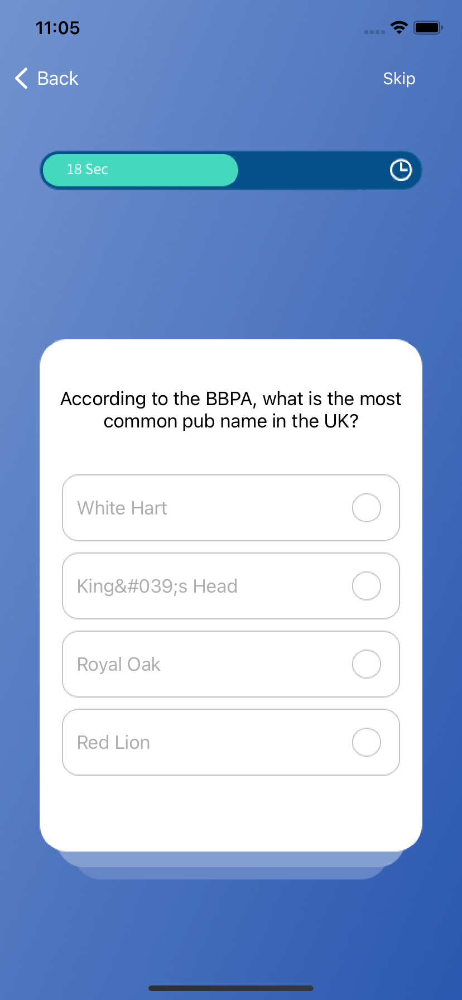
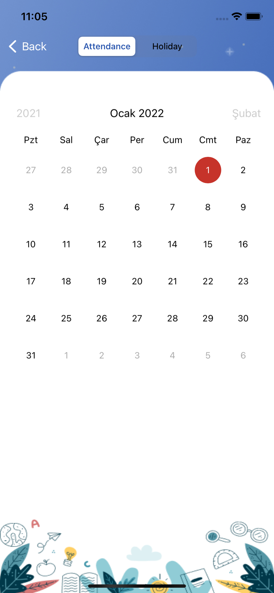
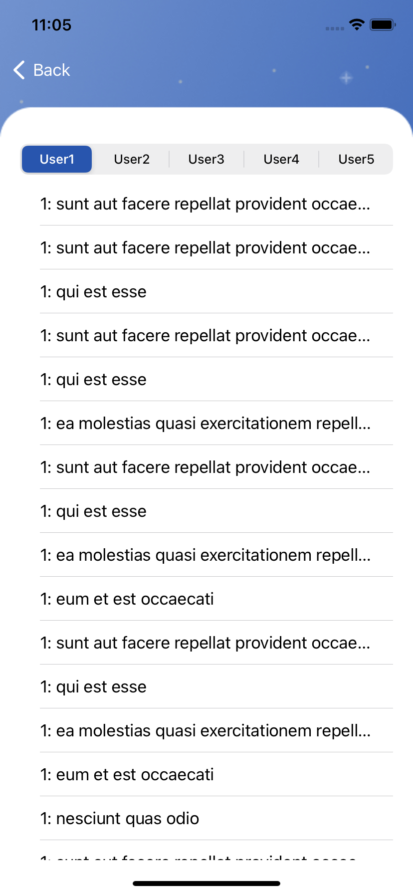
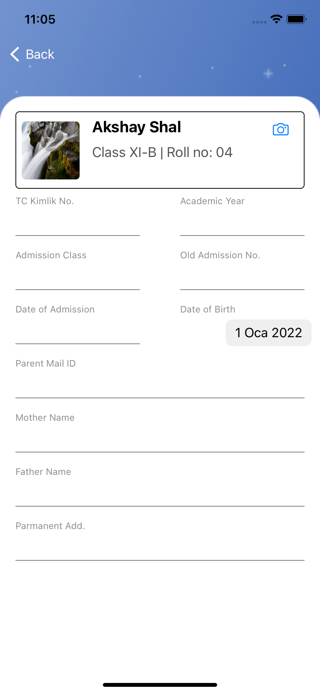
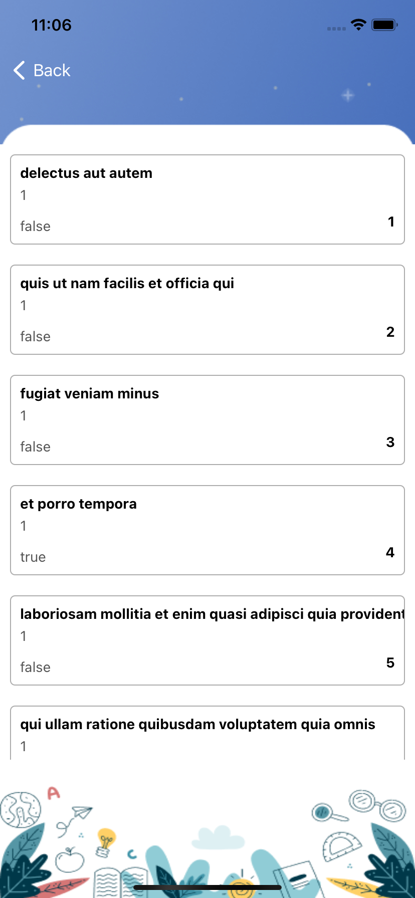
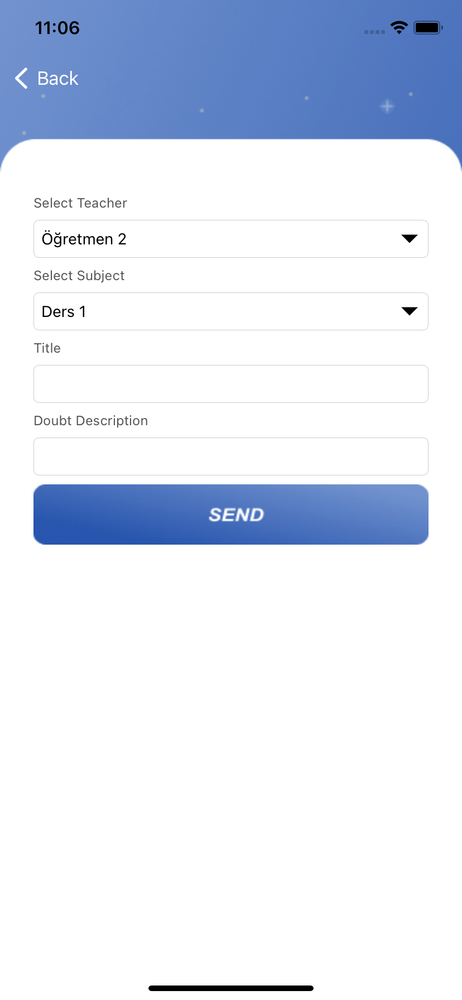
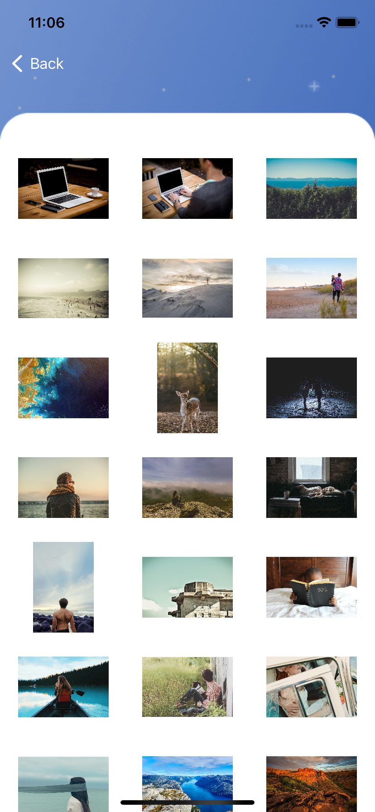
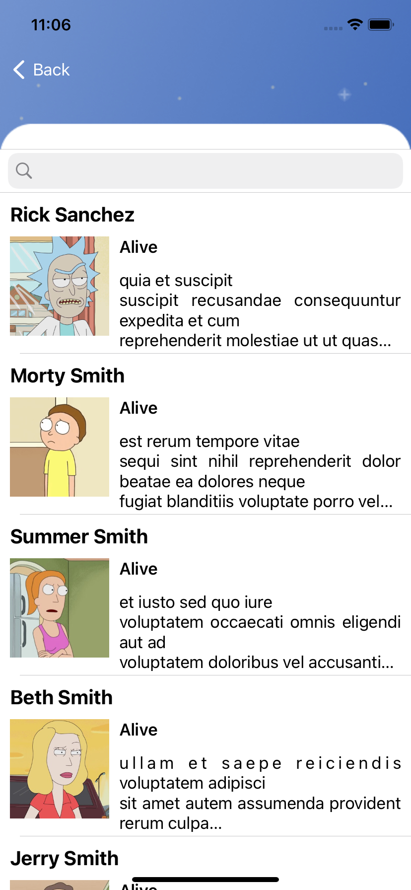

# SchoolApp

## Overview
The application was made to learn English words.

## Requirements
* iOS 13+
* Xcode 11.0+
* Swift 5.0+

## Screenshots

|  |  | 
|:---:|:---:|

|  |  | 
|:---:|:---:|

|  |  | 
|:---:|:---:|

|  |  | 
|:---:|:---:|

|  |  | 
|:---:|:---:|

## Author
Onur Basdas, onurebasdase@hotmail.com

